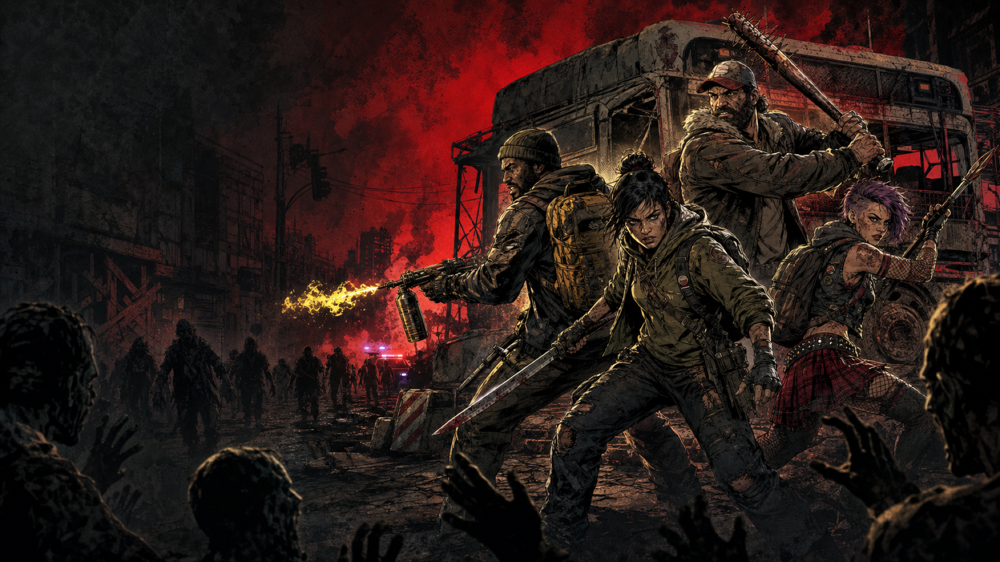
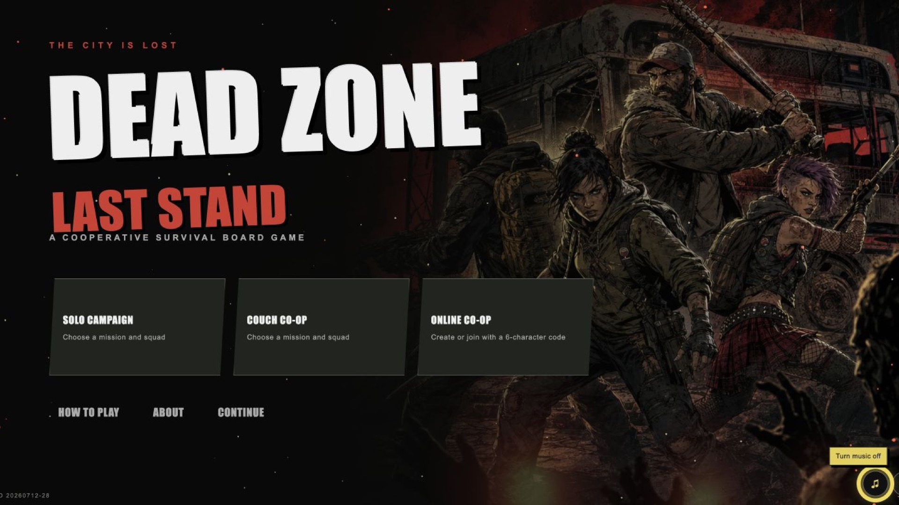
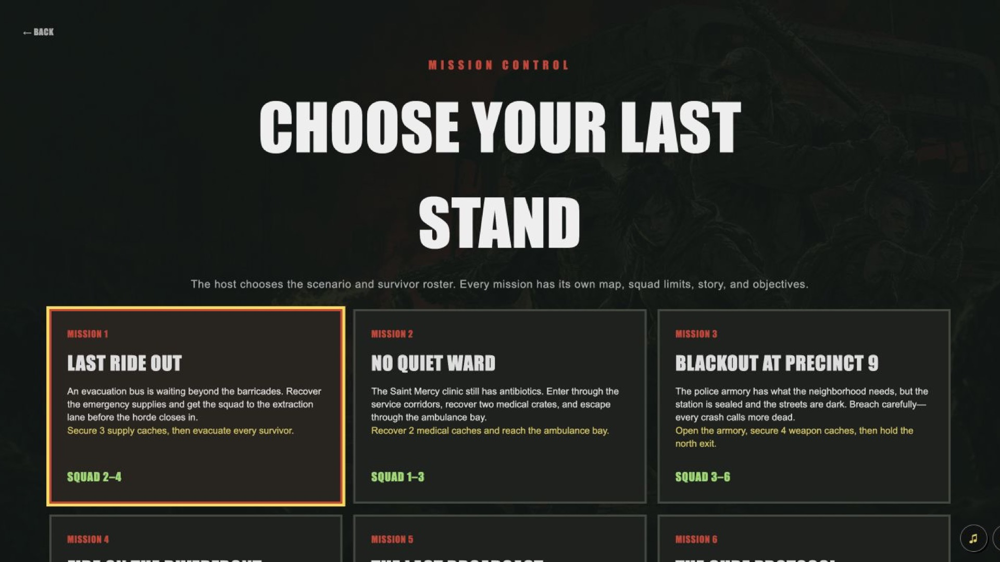
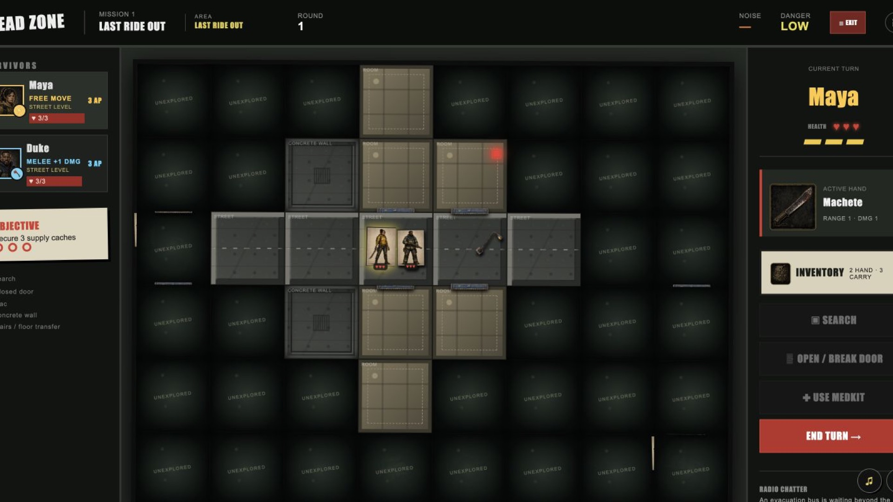

# Dead Zone: Last Stand



**Dead Zone: Last Stand** is a turn-based zombie survival board game for solo play, local multiplayer, and cross-platform online multiplayer. Assemble a squad of specialized survivors, search ruined city blocks for supplies, breach doors, fight escalating hordes, and complete mission objectives before reaching the evacuation zone.

The game features multiple missions and multi-floor maps, fog of war, survivor skills, inventory management, animated combat, atmospheric music and effects, and six-character room codes for joining games across different devices.

## Supported platforms

- **Computers and tablets** — play in a modern web browser with mouse, keyboard, or touch controls.
- **Amazon Fire TV** — Android TV package with D-pad and Fire TV remote/controller navigation.
- **Google TV / Android TV** — controller-friendly interface for compatible Android TV devices.

Cross-platform multiplayer allows players on computers, tablets, Amazon Fire TV, and Google TV to join the same game session using a six-character room code.

## Screenshots

### Main menu



### Mission and survivor selection



### Gameplay



## Highlights

- Solo, same-device local multiplayer, and synchronized online multiplayer
- Six-character room codes with optional share links
- Multiple missions, maps, floors, objectives, and evacuation scenarios
- Survivors with distinct combat, movement, medical, searching, and door-breaking skills
- Melee and ranged combat with line-of-sight, walls, doors, and weapon range rules
- Inventory loadouts, item trading, medkits, Molotov cocktails, and supply searches
- Walkers, specialized zombies, and late-game abominations
- Optional fog of war, music, sound effects, particles, and animated token movement
- Mouse, keyboard, touch, D-pad, and TV controller support

## Run locally

Requirements: Node.js 22.13 or later.

```bash
npm install
npm run dev
```

Open the local address shown in the terminal. To create a production build:

```bash
npm run build
```

Run the automated checks with:

```bash
npm test
```

## Fire TV / Android TV build

The Android TV wrapper is located in [`firetv/`](firetv/). Build a signed release with the configured Android signing environment:

```bash
JAVA_HOME=/opt/homebrew/opt/openjdk@17/libexec/openjdk.jdk/Contents/Home \
  ./firetv/gradlew -p firetv assembleRelease bundleRelease
```

## Developer

Developed by **PBURGLIN**.

